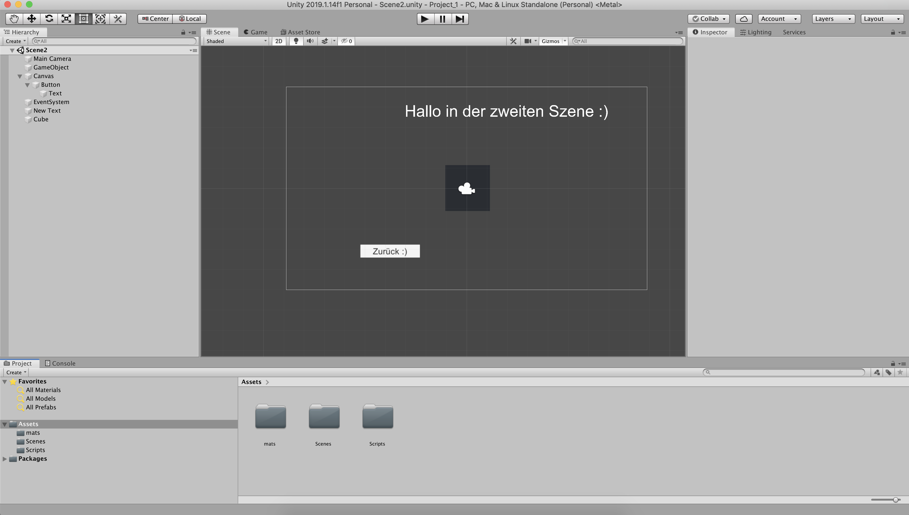
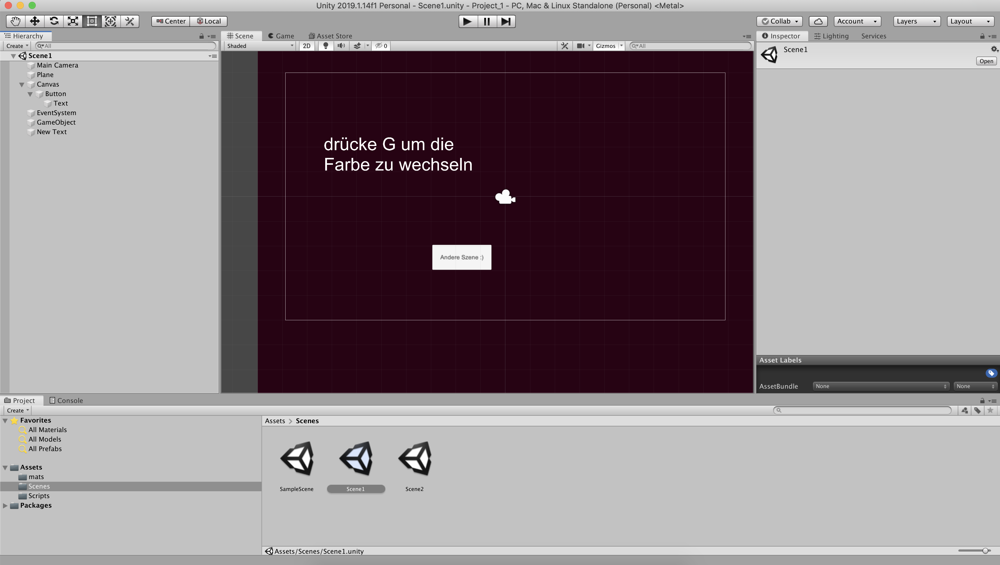

# 2019_erstes_project

This project is a revision of things I should have learned in 2018. 
In the first scene you can switch the background color by pressing "g". The colors change randomly. By clicking the button on screen you change to another scene where there is a square that detects how often you hover over it and can also change back to the first scene by pressing the same button as before.

#### Recources: 
* https://answers.unity.com/questions/147053/click-counter.html
* https://docs.unity3d.com/ScriptReference/MonoBehaviour.OnMouseOver.html
* https://answers.unity.com/questions/1369393/how-to-switch-between-scenes.html

* Version: Unity 2019.1.14f1

## Screenshots

